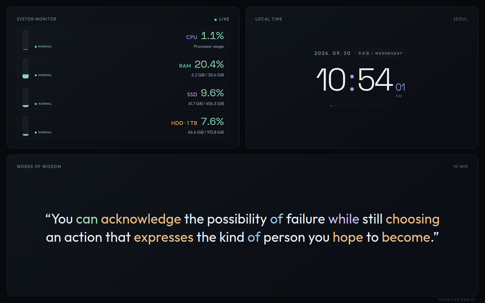

# ubuntu-scr-saver

A modern Ubuntu screensaver with live resource monitoring, a clock, and
180 English reflections. Built with Vite 8.3.1, TypeScript 7.0.2, and a Python
standard-library resource server.

## Stack actually used

Verified against the npm registry on 2026-09-30:

| Component | Installed version | Role |
| --- | --- | --- |
| Vite | 8.3.1, latest stable | Builds the production HTML, CSS, and JavaScript |
| TypeScript | 7.0.2, latest stable | All frontend behavior is implemented in typed modules |
| Node.js | 24.21.0 | Runs the build tools locally |
| Python | 3.14.4 | Runs the Linux resource API, idle monitor, and launcher |

`npm run build` runs the TypeScript check and Vite build. The Python service
serves the resulting assets from `dist/`; `index.html` imports `src/main.ts`,
which connects the clock, quote rotation, and resource dashboard modules.
The exact dependency versions are pinned in `package.json` and `package-lock.json`.
Versions are fixed for reproducibility; rerun `npm view vite version` and
`npm view typescript version` before updating them in the future.



The screen has three rectangular sections: monitoring in the upper left,
the clock in the upper right, and a large quote across the full lower half.

## Install

Requires Ubuntu GNOME, Python 3.10+, Google Chrome, and a Node.js version
supported by Vite (20.19+ or 22.12+).

```bash
git clone https://github.com/savvy773/ubuntu-scr-saver.git
cd ubuntu-scr-saver
./install.sh
```

The installer builds the frontend, adds a **scr-saver** desktop shortcut and
application entry, and enables `screensaver.service`. The service opens the
screensaver after 30 minutes of inactivity. Click the desktop icon to open it
at any time; press a key to exit. The mouse pointer stays visible; mouse movement,
clicks, and touch do not close the screensaver.

The local installation is `/home/suby/code/scr-saver`. The installer records
the current project path so it also works when cloned into another folder.
After moving an installed folder, run `./install.sh` again to update paths.

## Features

- CPU utilization, RAM usage, system disk `/`, and the 1 TB HDD at `/mnt/data`.
- Used and total capacity in GiB and percentages.
- One vertical usage bar per resource, smoothly updated without clearing readings.
- Bars sit on the left; colored resource labels sit beside right-aligned percentages.
- Green indicates normal usage, amber watch, and red high usage; labels accompany colors.
- Watch/high defaults: CPU 60/85%, RAM 75/90%, both disks 80/90%.
- Resource readings refresh three seconds after each completed request.
- Memory usage excludes available memory; disk percentages match `df`.
- A disconnected HDD shows as unavailable instead of reporting the root disk.
- Small clock with date, seconds, and AM/PM; subtle position shifts.
- Large English reflection every ten minutes, with 180 passages shuffled per cycle.
- Each passage contains 20–27 words, written for intermediate to advanced readers.
- Each passage is balanced into two lines, with adaptive sizing to fit the area.
- Auxiliary verbs are pastel green; main verbs are warm yellow-orange.
- Conjunctions such as "because", "while", and "although" are pastel lavender.
- Common prepositions are pastel sky blue; infinitive "to" stays neutral.
- The quote sequence and deadline persist in the dedicated Chrome profile.
- Responsive layout retains the three sections on smaller displays.

The passages are original reflections, without claims of attribution to famous authors.
Verb forms are curated per passage. A lightweight rule distinguishes auxiliary
uses of have/be from linking or possessive main verbs. The highlights are a
reading aid rather than a complete grammatical annotation of every word.
Resource readings and sayings work locally. Google Fonts load when available;
system fonts provide an offline fallback.

## Commands

```bash
python3 screensaver.py --now         # Open immediately
python3 screensaver.py --timer 10m   # Open in ten minutes
python3 screensaver.py --daemon --idle 1800

systemctl --user status screensaver.service
systemctl --user restart screensaver.service
```

The API and built frontend are served only on `127.0.0.1:8767`. Resource
readings are available at `/api/resources`. Files are served from `dist/`.

## Development

```bash
npm ci
npm run dev     # Vite with a proxy to the running resource service
npm run build   # Type check and build production assets
```

After building, an open screen reloads automatically within the resource refresh
interval. Restart the service when changing the Python backend.

- `src/`: TypeScript and CSS.
- `index.html`: Frontend entry point.
- `screensaver.py`: Idle monitor, launcher, and resource API.
- `install.sh`: Builds and installs the desktop shortcut and service.
- `launch.sh`: Starts the resource service before opening the screensaver.
- `assets/`: Desktop icon.
- `dist/`, `node_modules/`, and local backups are excluded from Git.
